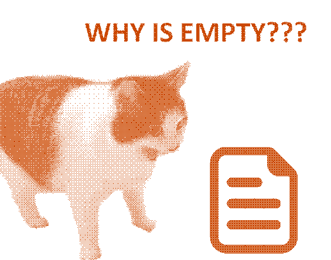

> Pictured: My brain during an attempt at putting words in a document

For six-weeks, I had kept a habit of publishing weekly entries in my blog during my batch at RC. Somewhere along the way I lost that habit, and rather than try to make-up for it, it became easier to just let it slide. Three weeks ago, when my batch ended, I told myself I would write-up a post-mortem of my time at RC, only to find it so very difficult to just sit down and *do it*.

So, in an effort to understand where things went wrong, I'm going to ponder what motivates me to write in the first place.

# motivation

I've told myself over and over that I should only write in my blog for myself and no-one else. "Pretend like nobody will ever read it." But that's kind of silly, isn't it? Of course I'm writing for others to read, otherwise I would just keep a journal (or more likely, nothing at all)!

So, what makes me want to write? Is it just because I see others writing and I want to join-in? Do I really think my voice needs to be added to the noise? Do I feel qualified to speak on anything others have already spoken on hundreds, if not thousands of times already? Do I think of myself so highly that I feel my "unique perspective" will really add anything of value to the conversation?

No. I'm not so delusional as to think that anything I have to say will stand-out any more than a single droplet within a vast cloud. Sure, one day perhaps I will find myself solving a particular problem that I end-up documenting and sharing in my blog that's oh-so very niche that it only currently applies to myself and maybe the one other poor lost soul to stray down my particular path of techno-masochism.

So then, why write in a blog at all? Well, I didn't really have the answer to this firmly in mind when I sat down to write, but perhaps it is just for that one hypothetical lost soul. Maybe it's worth all the effort, for their sake. And perhaps they won't care too much about my grammatical errors or my meandering writing style if it means they get to avoid making the same mistakes I did.

# distraction

Motivation is all well and good, but if I don't have the ability to focus on writing, then it's not enough. Something I struggle with constantly is the ability to focus and plan my time effectively. In the face of choosing between tweaking this website's presentation, fiddling with some obscure function in Emacs, or writing a few sentences in my long-overdue blog post, I will choose the former two almost every time.

It wouldn't surprise me if I was diagnosed with some kind of neurological disorder, in fact it would be a relief to know that it's not just a "lack of character" on my part. So, perhaps instead of being so hard on myself for not being able to focus on things like a "normal" person, I should work towards finding out how to work with the way my brain functions by seeking a neurological assessment. Though, admittedly this sounds daunting.

# conclusion

I started this post feeling down on myself for finding it so hard to write, but as I type out this conclusion I'm feeling good about what I've written, even if it's a little scattered and clumsy, I finally wrote *something*. And now that I've done some self-(re-)discovery I can move forward and continue writing, for that one other person out there.

Until next time.
